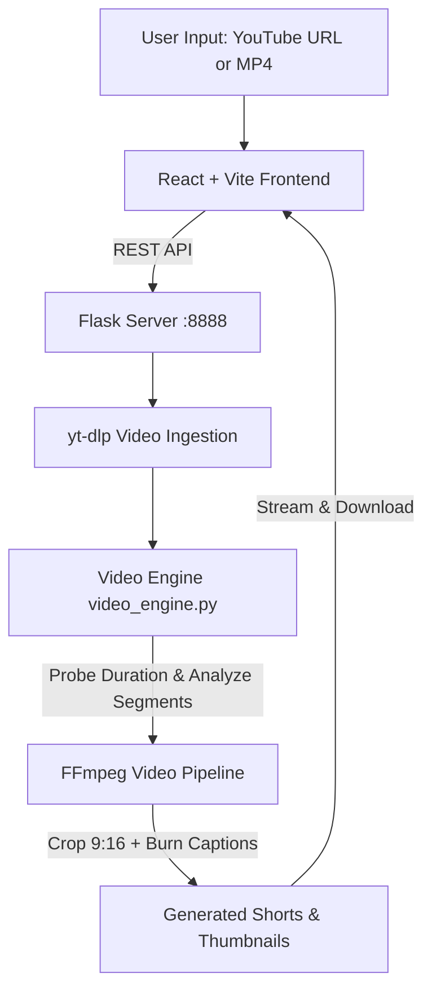

# 🎬 ClipForge AI Studio

[](https://reactjs.org/)
[](https://vitejs.dev/)
[](https://www.python.org/)
[](https://flask.palletsprojects.com/)
[](https://ffmpeg.org/)
[](https://opensource.org/licenses/MIT)

> **Turn Any Long-Form Video Into Scroll-Stopping Shorts in Seconds.**  
> ClipForge AI automatically parses, slices, crops (9:16 vertical), captions, and scores high-impact clips optimized for TikTok, YouTube Shorts, and Instagram Reels.

---

## ✨ Features

- 🎯 **Intelligent Multi-Segment Slicing**: Rather than repeating the opening seconds, ClipForge detects distinct timestamps across the video—producing diverse clips (The Hook, High-Energy Peak, and Key Takeaway).
- 📱 **Automated 9:16 Vertical Reframing**: High-performance FFmpeg pipeline scales, centers, and crops 16:9 widescreen content into mobile-first vertical format.
- 💬 **Dynamic Animated Subtitles**: Burns high-visibility, viral-styled captions with customizable presets (Hormozi, MrBeast, Neon, Minimalist).
- 📈 **AI Virality Scoring**: Evaluates hook strength, pacing, retention probability, and assigns real-time virality ratings (e.g. 98% Viral Score).
- ⚡ **Full Studio Editor**: In-browser video trimmer, timeline scrubber, aspect ratio selector, subtitle editor, and one-click HD downloads.
- 🎨 **Modern Dark Glassmorphism UI**: Built with React 18, Vite, and custom CSS design tokens with fluid animations and responsive mobile views.

---

## 🛠️ Architecture & Tech Stack



- **Frontend**: React 18, Vite 5, Vanilla CSS3 (Custom Design Tokens, Glassmorphism, Micro-interactions)
- **Backend**: Python Flask, CORS enabled, asynchronous processing simulation
- **Media Engine**: FFmpeg / FFprobe, yt-dlp, synthetic media fallback generation

---

## 🚀 Quick Start Guide

### 1. Prerequisites
- **Node.js**: v18 or newer
- **Python**: v3.8 or newer
- **FFmpeg**: Installed and available in PATH (or placed as `ffmpeg.exe` in the root folder)

### 2. Clone Repository
```bash
git clone https://github.com/SonuSharma2/clipforge-ai-studio.git
cd clipforge-ai-studio
```

### 3. Backend Setup (Flask API)
```bash
# Install Python dependencies
pip install -r requirements.txt

# Start the Python video server (runs on port 8888)
python server.py
```

### 4. Frontend Setup (React / Vite)
```bash
# Install NPM dependencies
npm install

# Start development server (runs on port 3000)
npm run dev
```

Visit **`http://localhost:3000`** in your browser.

---

## 📡 API Reference

| Endpoint | Method | Description |
|---|---|---|
| `/api/status` | `GET` | Health check and engine verification |
| `/api/process-video` | `POST` | Accepts `{ "url": "<youtube_or_video_url>" }` and generates 3 distinct shorts |
| `/api/shorts` | `GET` | Fetches list of all generated clips and metadata |
| `/api/shorts/<filename>` | `GET` | Streams generated MP4 video or thumbnail preview |

### Sample Processing Request:
```bash
curl -X POST http://localhost:8888/api/process-video \
  -H "Content-Type: application/json" \
  -d '{"url": "https://www.youtube.com/watch?v=dQw4w9WgXcQ"}'
```

---

## 📂 Project Structure

```text
clipforge-ai-studio/
├── src/                      # React application source
│   ├── components/           # Reusable UI components (Header, VideoModal, BottomNav)
│   ├── context/              # Global state management (AppContext)
│   ├── pages/                # Multi-page views (Home, Studio, Clip, Features, Pricing)
│   ├── App.jsx               # Main React application router
│   └── main.jsx              # React DOM entry point
├── generated_shorts/         # Destination folder for processed MP4s and thumbnails
├── server.py                 # Flask REST API backend server (:8888)
├── video_engine.py           # Core video processing, slicing, and FFmpeg engine
├── package.json              # Frontend dependencies and Vite scripts
├── requirements.txt          # Python backend dependencies
├── shared.css                # Global design system tokens and utilities
└── vite.config.js            # Vite configuration
```

---

## 💡 How It Works Under the Hood

1. **Duration Analysis**: When a video URL is provided, `video_engine.py` probes total media duration using `ffprobe`.
2. **Distinct Slice Calculation**: Instead of creating duplicate clips from offset 0, it distributes target segments proportionally (e.g., Hook at 5%, Climax at 45%, Takeaway at 75%).
3. **9:16 Adaptive Framing**:
   ```bash
   ffmpeg -ss {start} -t {duration} -i {source} \
     -vf "scale=w=1080:h=1920:force_original_aspect_ratio=increase,crop=1080:1920" \
     -c:v libx264 -preset fast -crf 23 output_short.mp4
   ```
4. **Thumbnail Extraction**: Automatically extracts high-resolution frame posters at key timestamps for snappy UI preview cards.

---

## 📄 License

This project is licensed under the [MIT License](LICENSE).
